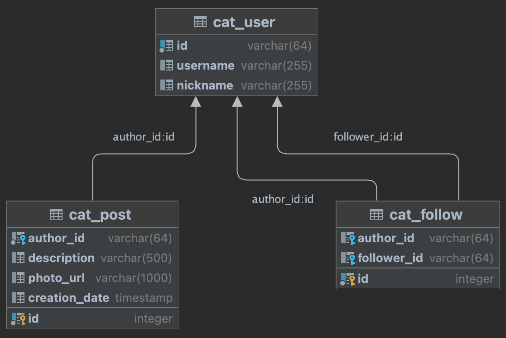

# Catsgram

    
Описание

    Сквозной проект 3-го модуля посвященного SpringBoot.

Catsgram (Котограм) - приложение для владельцев котов и кошек, чтобы они могли делиться фотографиями своих питомцев.

По функциональности Котограм похож на известную и созвучную по названию социальную сеть. Приложение имеет следующую логику — взаимодействие с пользователями, публикацию постов, обмен лайками и комментариями. Для хранения этой информации будет использована база данных PostgreSQL.

DB schema:

